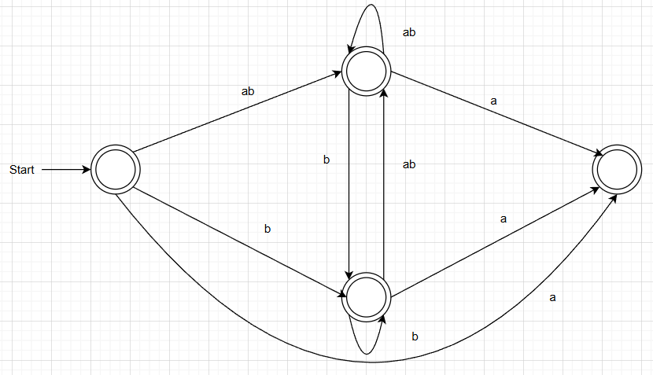
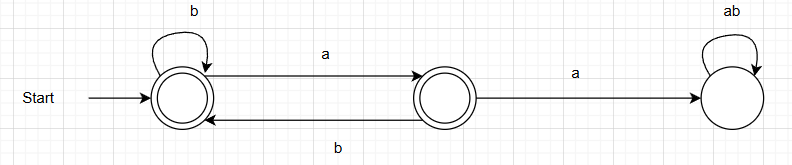

## Assignment 2
### 3.2
Regular expression that recognizes all sequences of *a* and *b* where two *a*'s are always separated by at least one *b*:

(b | ab)* a? 

NFA

DFA

### 3.3
Writing out the rightmost derivation of the string:

`let z = (17) in z + 2 * 3`
Using the grammar specified in `ExprPar.fsy`. The grammar rules:

`A: Main -> Expr EOF`  
`B: Expr -> NAME`  
`C: Expr -> CSTINT`  
`D: Expr -> MINUS CSTINT`  
`E: Expr -> LPAR Expr RPAR`  
`F: Expr -> LET NAME EQ Expr IN Expr END`  
`G: Expr -> Expr TIMES Expr`  
`H: Expr -> Expr PLUS Expr`  
`I: Expr -> Expr MINUS Expr`

The rightmost derivation:  
`A)     Expr EOF`  
`F)     LET NAME EQ Expr IN Expr END EOF`  
`H)     LET NAME EQ Expr IN Expr PLUS Expr END EOF`  
`G)     LET NAME EQ Expr IN Expr PLUS Expr TIMES Expr END EOF`  
`C)     LET NAME EQ Expr IN Expr PLUS Expr TIMES CSTINT END EOF`  
`C)     LET NAME EQ Expr IN Expr PLUS CSTINT TIMES CSTINT END EOF`  
`B)     LET NAME EQ Expr IN NAME PLUS CSTINT TIMES CSTINT END EOF`  
`E)     LET NAME EQ LPAR Expr RPAR IN NAME PLUS CSTINT TIMES CSTINT END EOF`  
`C)     LET NAME EQ LPAR CSTINT RPAR IN NAME PLUS CSTINT TIMES CSTINT END EOF`

The rightmost derivation is therefore: 

`LET NAME EQ LPAR CSTINT RPAR IN NAME PLUS CSTINT TIMES CSTINT END EOF`
### 3.4