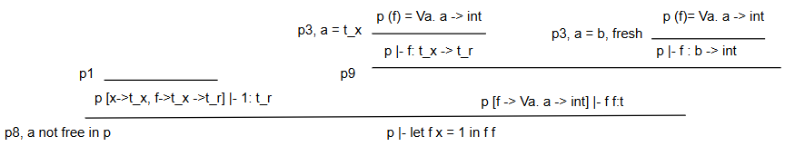
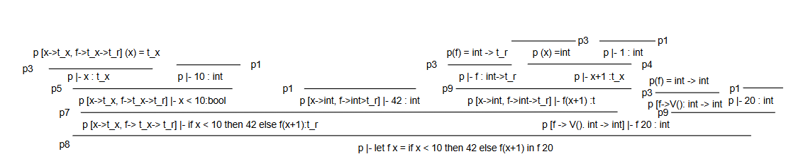

### Exercise 6.4
i)

The type of `f` needs to be polymorphic as it does not constraint its parameter at all. `f f` can't be typed if `f` is forced to have a single type as it would create a self referential equation.  
ii)

`f` is monomorphic in this case because every single use of `f` is consistent with one type, `int -> int`. It can also be seen in the tree as once everything is resolved there are no free variables left.

### Exercise 6.5
#### Part one
i)
```
let f x = 1
in f f end
```
Results in `int`

ii)
```
let f g = g g
in f end
```
Results in `System.Exception: type error: circularity`

This is not typable, because in `g g` the `g` is used as a function, so the type must be `'a -> 'b`. However `g` is also the argument, so it must have type `'a`. Meaning that the program gives `'a = 'a -> 'b` which results in an circulartity error.

iii)
```
let f x =
    let g y = y
    in g false end
in f 42 end
```
Results in `bool`

iv)
```
let f x =
    let g y = if true then y else x
    in g false end
in f 42 end
```
Results in `System.Exception: type error: bool and int`

This is also not typable, because the if-statement uses `x` and `y` and these must have the same type, but `g false` makes `y` a `bool`, so `x` must also be `bool`, but `f 42` passes `x` as an `int`.

v)
```
let f x =
    let g y = if true then y else x
    in g false end
in f true end
```
Results in `bool`

#### Part two 
i)  
`bool -> bool`
```
let neg b = 
    if b then false    else true
in neg end
```

ii)

`int -> int`
```
let inc n = 
    n + 1
in inc end
```

iii)  
`int -> int -> int`
```
let add a = 
    let h b = 
        a + b
    in h end
in add end
```

iv)  
`'a -> 'b -> 'a`
```
let first a = 
    let h b = 
        a
    in h end
in first end
```

v)  
`'a -> 'b -> 'b`
```
let second a = 
    let h b = 
        b
    in h end
in second end
```

vi)  
`('a -> 'b) -> ('b -> 'c) -> ('a -> 'c)`
```
let compose f = 
    let h g = 
        let k x = 
            g (f x)
        in k end
    in h end
in compose end
```

vii)  
`'a -> 'b`
```
let loop x = 
    loop x
in loop end
```

vii)  
`'a`
```
let loop x = 
    loop x
in loop 1 end
```