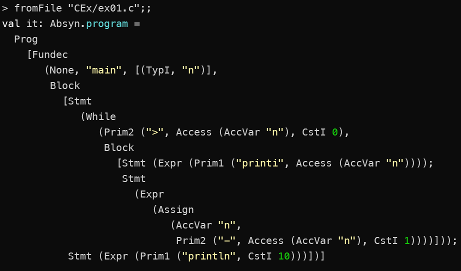

### Exercise 7.1
The output from running `fromFile "CEx/ex01.c"`.

The above shows the abstract syntax tree. We can see a function called `main` which takes an integer `n`. Then there is some statements: `While`, `Print`, `Assign` and another `Print` statement. We see a `TypI` in the declaration of the function. There are multiple expressions, such as the the first print statement and the last print statement and the assignment of `n` at the end of the `while` loop.

### Exercise 7.2
i) The program can be found in the `CEx/ex71i.c` folder.